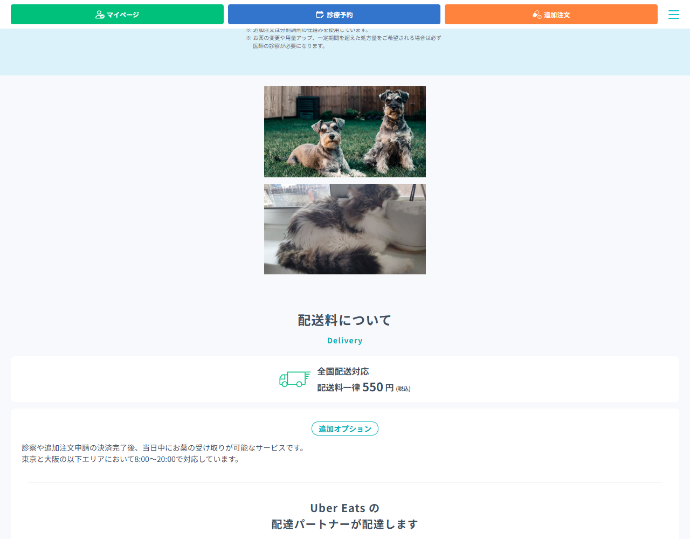

<!-- _class: lead -->

# 競合LPを「そっくりコピー」して、狙った要素だけ差し替える

スクショから作るのをやめて、本物を丸ごともらって部品を貼り替える

<small>※相談者：Masaya Kokabu／たたき台・デモ用。公開時は中身を自社情報に差し替える</small>

---

## まず結論（4行）

- **スクショから作る（画像コーディング）はやめる。** これが「何度直しても不自然」「工数がかかる」の正体。
- 競合LPを**そっくりコピー**する（表示し終わった状態を丸ごと1枚のHTMLに保存）。
- コピー後は、**スクショで指さず「文字」や「class名」で要素を指定**して差し替える。
- 道具はどれか1つでOK（Claude Code / GitHub Copilot / Codex）。公開前に**中身は自社のものに差し替える**。

---

## たとえ話：ねんど／プラモ

| やり方 | イメージ | 向き不向き |
|---|---|---|
| **スクショから作る** | 写真を見て**ねんど**で再現 | 鼻だけ直すと顔ごと崩れる。今つまずいているのはこれ |
| **そっくりコピー** | 完成済みの**プラモ**を丸ごと入手 | 文字・画像・色の**貼り替えは得意**。広告画像を動物に、も簡単 |

> ゼロから似せる（ねんど）のをやめ、本物を丸ごともらって部品を貼り替える。

---

## なぜ「スクショから作る」だけは避けるのか

つまずきの正体は **画像コーディング（スクショ → コード）**。

- 見た目だけ真似るので、コードが**継ぎ目のない一枚岩**になる。
- だから**一部を直すと全体が崩れる**。「何度直しても不自然」「工数がかかる」。

→ 似せる作業をやめて、**まず“本物をそっくりコピー”**する。

---

## ステップ1：そっくりコピーする

JavaScriptで動くサイト（DMMもこれ）でも、**表示し終わった状態を丸ごと1枚のHTML**にすれば、ネットなしで同じ見た目に。無料ツール **SingleFile** が定番でエージェントに任せられる。

**そのまま打つプロンプト**

> `https://clinic.dmm.com/` を、**表示し終わった後の状態のまま丸ごと1つのHTMLに保存**して。CSSも画像も埋め込んで、ネットがなくても同じ見た目で開けるようにして。SingleFile（single-file-cli）を使ってよい。保存先は `sample-lp/dmm-copy.html`。

---

## ステップ2：どこを直すか「言葉」で伝える

**スクショで「ここ」と見せるのは実はNG。** エージェントは見た目しか分からず、場所を“推測”するから少しズレる。
正しくは次の順で**言葉で**伝える。

1. **文字で指定**：画面に出ている言葉を渡す（中を検索して一発で当たる）
2. **class名で指定**：検証で見つけた“住所”を渡す（いちばん正確）
3. **場所で指定**：「料金表の下の横長バナー2枚のうち上」など

---

## class名が読めないとき：エージェントに探させる

class名は自動生成で**人間がパッと読めないことも多い**（例 `css-1a2b3c`）。自分で読まず、エージェントに探させる。

- **手軽**：ブラウザ内蔵の**検証（DevTools）**だけでOK。インストール不要。
- **もっと楽**：エージェントに **MCP** をつなぐ。MCP（Model Context Protocol）＝エージェントに“外部の道具”をつなぐ共通規格。ブラウザ操作用の代表が **Chrome DevTools MCP（Google公式）** と **Playwright MCP（Microsoft）**。

> エージェント自身がページを開いて要素を探すので、class名を読む必要すらない：
> 「『LINE公式アカウント』の広告バナーを探して、画像を `images/dog.jpg` に差し替えて。」

---

## 実例ウォークスルー（今回ほんとうに DMM で実施）

例：「**広告を2つにして、画像を動物に変更**」を実コピーに適用。

1. **そっくりコピー** … `clinic.dmm.com` を丸ごと保存 → `dmm-copy.html`（約3MB・本物そっくり）
2. **広告を特定** … 広告は `class="fn-promotionLink"` の `<a>` 内の画像2枚（料金表下の横長バナー）
3. **動物に差し替え** … その2枚を犬・猫のフリー素材へ

> プロンプト：「`dmm-copy.html` の `fn-promotionLink` の広告バナー2枚の画像を、`images/dog.jpg` と `images/cat.jpg` に差し替えて。`<picture>` の `<source>` も消し、`` の `src` を動物画像に。レイアウトは変えない。」

---

## 出来上がり（実物）

本物のナビ・配送料・Uber Eats は**そのまま**、**広告2枠だけ犬と猫に差し替え**。スクショで指さず class名（住所）を渡すだけで正確に当たった。

---

## Microsoft Clarity（PDCAの計測ツール・無料）

公開後に「**どこで止まり・どこで離れたか**」を可視化（Microsoft製）。

- **ヒートマップ**：クリック・スクロール・注目を**色**で表示
- **セッション録画**：訪問者の操作を**動画**で再生（rage click や離脱がわかる）
- **AI（Copilot）**：録画を**日本語で要約**「どこでつまずいたか」

特徴：**完全無料・上限なし**、GA4連携、GDPR/CCPA準拠で個人情報を自動マスク、導入は**タグ1つ**。

---

## やってはいけないこと（法務）

- そっくりコピーを**そのまま公開しない**。
- 競合の**文章・画像・ロゴ・料金・ビフォーアフター数値は流用しない**。借りていいのは**構成・導線**まで。
- 医療LPは**薬機法・医療広告ガイドライン**の対象。
- コピーは**たたき台・見比べ用**。公開LPは**中身を全部自社のものに**してから。

---

## AIに「全部おまかせ」しない4つ／最初の一歩

**おまかせしない**

1. だれに何を伝えるか（作戦）
2. 内容が本当か・法律的に大丈夫か（特に医療）
3. 自社らしさ（テンプレ感を脱する）
4. 全体の仕上がりチェック

**最初の一歩**：①エージェント起動 → ②`clinic.dmm.com` をそっくりコピー → ③文字かclass名で**1か所だけ**差し替えてみる。

---

## （補足）大きく作り変えたくなったら：作り直し

そっくりコピーは**部品が貼り付け済み**で、画像・文字の差し替えは得意でも**大改造は苦手**。本格運用でレイアウトから自由に直したくなったら、競合を**設計図**として参考に、**きれいな部品（コンポーネント）**で組み直す。

> 「構成（どのセクションが・どの順で・最後に何を押させるか）を設計図にして」→「それをもとに Next.js + Tailwind で **部品に分けて**作って。文字・画像は自社情報で」

まずは**そっくりコピーで十分**。必要になってからでよい。
